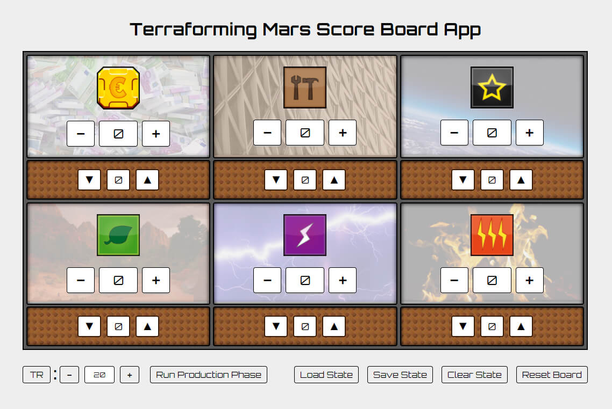
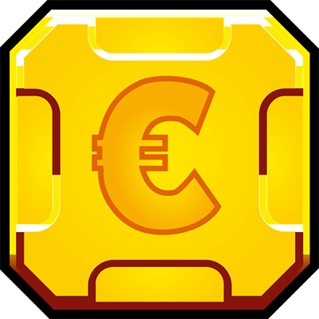
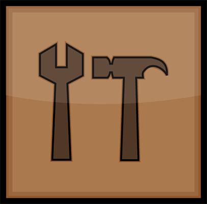
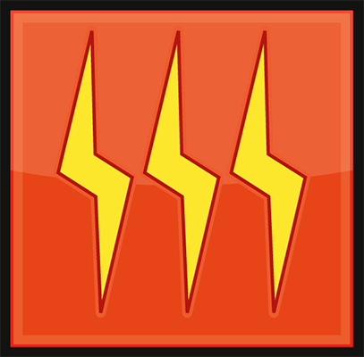

# Terraforming Mars Score Board App

Digital recreation of the score card mat for the game [Terraforming Mars](https://boardgamegeek.com/boardgame/167791/terraforming-mars).



Hosted on github pages [here](https://steview-d.github.io/tm-score-app/).

Anyone who has played Terraforming Mars will know the pain of being an hour into a game and then accidently moving the score card. Your cubes fly off in all directions, forcing you to spend the next 10 minutes trying to figure out where they all were.

This app tries to solve that problem. It works on displays of all sizes, but I find it's best used with a tablet - something around the same size as the original player mats.

## How does it work?

If you have played Terraforming Mars before, it should already be clear how this app works.

### Icons

|Icon|Resource|
|---|---|
||Credits|
||Steel|
||Titanium|
||Greenery|
||Power|
||Heat|

### Buttons


Track the `Terraform Rating` with these buttons. This value is used when running the `production phase`, to calculate the correct number of credits.


```
Run Production Phase
```
